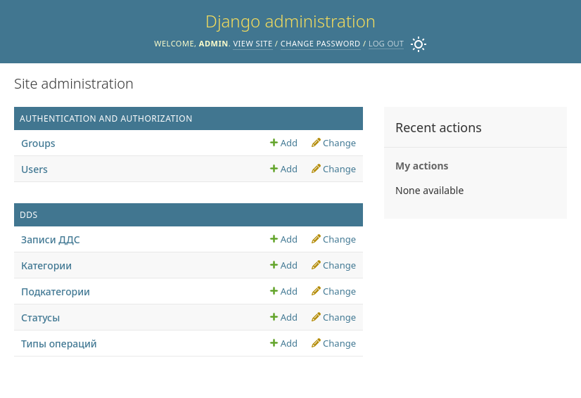
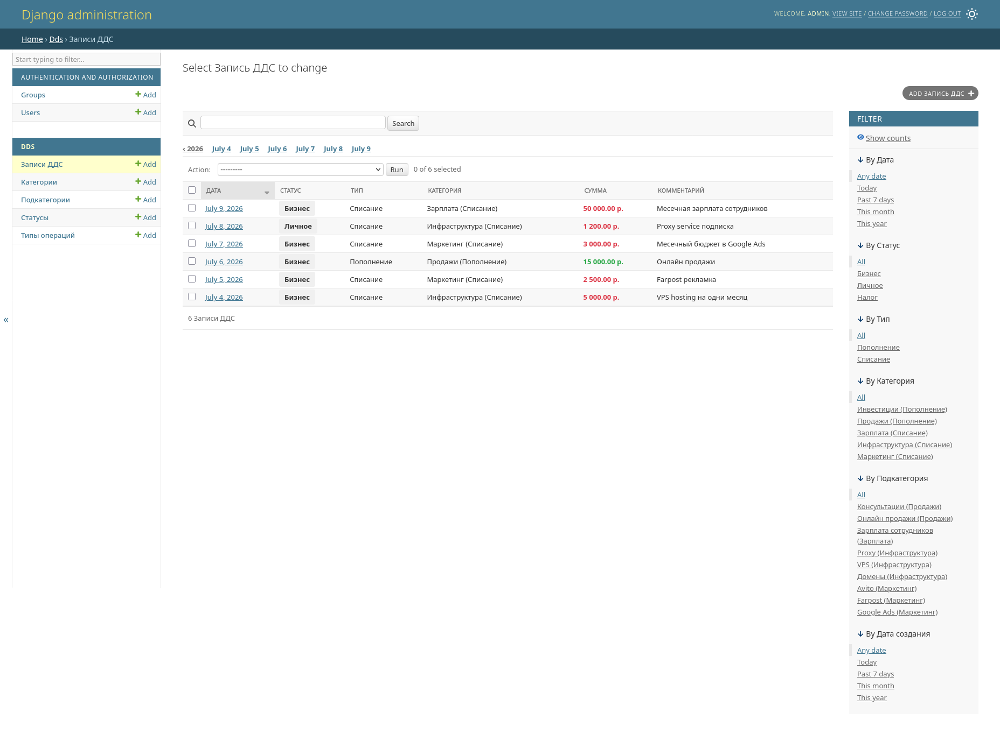
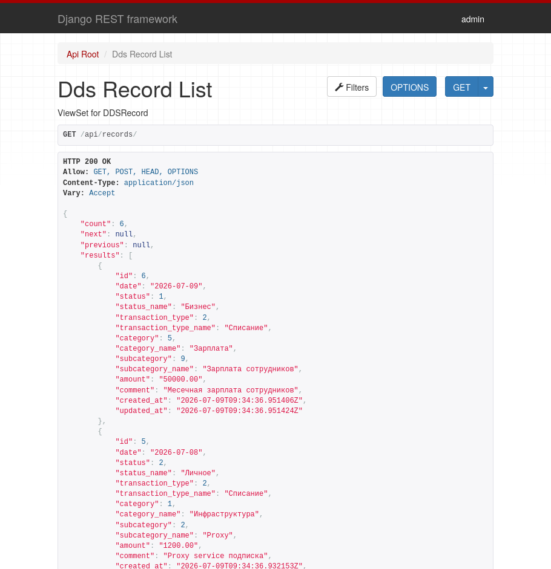

# Веб-сервис для управления движением денежных средств (ДДС)

Веб-сервис для управления движением денежных средств (ДДС) с поддержкой иерархической категоризации.

## Описание

Приложение позволяет пользователям:
- Создавать, редактировать, удалять и просматривать записи о движении денежных средств
- Управлять справочниками (статусы, типы, категории, подкатегории)
- Использовать иерархические зависимости между сущностями
- Фильтровать записи по различным критериям
- Взаимодействовать через веб-интерфейс (Django Admin) или REST API

## Требования

- Python 3.8+
- Django 6.0.7
- Django REST Framework
- django-filter

## Установка

### 1. Клонирование репозитория

```bash
git clone <repository_url>
cd test_of_first-it-company
```

### 2. Создание виртуального окружения

```bash
python -m venv .venv
source .venv/bin/activate  # На Windows: .venv\Scripts\activate
```

### 3. Установка зависимостей

```bash
pip install -r requirements.txt
```

### 4. Применение миграций

```bash
python manage.py migrate
```

### 5. Создание суперпользователя для admin

```bash
python manage.py createsuperuser
```

### Опционально: Загрузка примеров данных

```bash
# Загрузка справочных данных (статусы, типы, категории, подкатегории) 
# Которые были указаны в тестовом задании
python manage.py init_reference_data

# Тоже самое, но ещё загружаются примеры записей ДДС
python manage.py seed_data
```

### 6. Запуск приложения

```bash
python manage.py runserver
```

Приложение будет доступно по адресу: `http://localhost:8000`

## Структура данных

### Модели и иерархия

```
Status (Статус)
├── Бизнес
├── Личное
└── Налог

TransactionType (Тип операции)
├── Пополнение
│   └── Category: Infrastructure, Продажи, ...
│       └── Subcategory: VPS, Proxy, ...
└── Списание
    └── Category: Маркетинг, Зарплата, ...
        └── Subcategory: Farpost, Avito, ...

DDSRecord (Запись ДДС)
├── date (Дата)
├── status (Статус)
├── transaction_type (Тип)
├── category (Категория)
├── subcategory (Подкатегория)
├── amount (Сумма)
└── comment (Комментарий)
```

## Использование

### Веб-интерфейс (Django Admin)

1. Перейдите на `http://localhost:8000/admin/`
2. Войдите с учетными данными суперпользователя
3. Управляйте данными через интеграцию админ-панели



#### Основные возможности админ-панели:

- **Статусы**: Добавление, редактирование и удаление статусов
- **Типы операций**: Управление типами операций
- **Категории**: Создание категорий, связанных с типами операций
- **Подкатегории**: Создание подкатегорий, связанных с категориями
- **Записи ДДС**: Создание и управление записями с автоматической фильтрацией подкатегорий



#### 1. Добавить новый статус
1. Перейдите в Admin → Статусы
2. Нажмите "Add Status"
3. Введите название и описание
4. Сохраните

#### 2. Добавить тип операции
1. Admin → Типы операций → Add Transaction Type
2. Введите название
3. Сохраните

#### 3. Добавить категорию
1. Admin → Категории → Add Category
2. Выберите тип операции
3. Введите название категории
4. Сохраните

#### 4. Добавить подкатегорию
1. Admin → Подкатегории → Add Subcategory
2. Выберите категорию
3. Введите название подкатегории
4. Сохраните

#### 5. Создать запись ДДС
1. Admin → Записи ДДС → Add Record
2. Выберите дату (автоматически текущая дата)
3. Выберите статус
4. Выберите тип операции
5. Выберите категорию (фильтруется по типу)
6. Выберите подкатегорию (фильтруется по категории)
7. Введите сумму
8. Добавьте комментарий (необязательно)
9. Сохраните

#### 6. Фильтровать записи
1. Admin → Записи ДДС
2. Используйте фильтры в правой панели:
   - По дате
   - По статусу
   - По типу операции
   - По категории
   - По подкатегории


### REST API

#### Доступные endpoints

```
GET    /api/statuses/                      # Список статусов
POST   /api/statuses/                      # Создать статус
GET    /api/statuses/{id}/                 # Получить статус
PUT    /api/statuses/{id}/                 # Обновить статус
DELETE /api/statuses/{id}/                 # Удалить статус

GET    /api/transaction-types/             # Список типов
POST   /api/transaction-types/             # Создать тип
GET    /api/transaction-types/{id}/        # Получить тип
PUT    /api/transaction-types/{id}/        # Обновить тип
DELETE /api/transaction-types/{id}/        # Удалить тип

GET    /api/categories/                    # Список категорий
POST   /api/categories/                    # Создать категорию
GET    /api/categories/{id}/               # Получить категорию
PUT    /api/categories/{id}/               # Обновить категорию
DELETE /api/categories/{id}/               # Удалить категорию
FILTER /api/categories/?transaction_type={id}  # Фильтр по типу

GET    /api/subcategories/                 # Список подкатегорий
POST   /api/subcategories/                 # Создать подкатегорию
GET    /api/subcategories/{id}/            # Получить подкатегорию
PUT    /api/subcategories/{id}/            # Обновить подкатегорию
DELETE /api/subcategories/{id}/            # Удалить подкатегорию
FILTER /api/subcategories/?category={id}   # Фильтр по категории

GET    /api/records/                       # Список записей
POST   /api/records/                       # Создать запись
GET    /api/records/{id}/                  # Получить запись
PUT    /api/records/{id}/                  # Обновить запись
DELETE /api/records/{id}/                  # Удалить запись
```

Поскольку в проекте используется Django REST Framework запросы можно делать и ручками, например для тестирования.


#### Примеры запросов

##### Создание статуса

```bash
curl -X POST http://localhost:8000/api/statuses/ \
  -H "Content-Type: application/json" \
  -d '{"name": "Business", "description": "Business transactions"}'
```

##### Создание типа операции

```bash
curl -X POST http://localhost:8000/api/transaction-types/ \
  -H "Content-Type: application/json" \
  -d '{"name": "Пополнение", "description": "Money replenishment"}'
```

##### Создание категории

```bash
curl -X POST http://localhost:8000/api/categories/ \
  -H "Content-Type: application/json" \
  -d '{"name": "Маркетинг", "transaction_type": 1, "description": "Marketing expenses"}'
```

##### Создание подкатегории

```bash
curl -X POST http://localhost:8000/api/subcategories/ \
  -H "Content-Type: application/json" \
  -d '{"name": "Farpost", "category": 1, "description": "Farpost ads"}'
```

##### Создание записи ДДС

```bash
curl -X POST http://localhost:8000/api/records/ \
  -H "Content-Type: application/json" \
  -d '{
    "date": "2025-01-15",
    "status": 1,
    "transaction_type": 1,
    "category": 1,
    "subcategory": 1,
    "amount": "1000.00",
    "comment": "Payment for Farpost advertising"
  }'
```

##### Фильтрация записей

```bash
# По статусу
curl http://localhost:8000/api/records/?status=1

# По типу операции
curl http://localhost:8000/api/records/?transaction_type=1

# По категории
curl http://localhost:8000/api/records/?category=1

# По дате
curl http://localhost:8000/api/records/?date=2025-01-15

# Комбинированная фильтрация
curl http://localhost:8000/api/records/?status=1&transaction_type=1&date=2025-01-15
```

##### Получить все записи
```bash
curl http://localhost:8000/api/records/
```

Или опять же ручками



##### Удалить запись
```bash
curl -X DELETE http://localhost:8000/api/records/1/
```


## Валидация

### Бизнес-правила

1. **Категория должна относиться к типу операции**
   - При выборе категории она должна быть связана с выбранным типом операции
   
2. **Подкатегория должна относиться к категории**
   - При выборе подкатегории она должна быть связана с выбранной категорией
   
3. **Обязательные поля**
   - `amount` (Сумма) - обязательно
   - `transaction_type` (Тип) - обязательно
   - `category` (Категория) - обязательно
   - `subcategory` (Подкатегория) - обязательно
   - `status` (Статус) - обязательно
   
4. **Сумма должна быть положительной**
   - Сумма > 0

5. **Опциональные поля**
   - `comment` (Комментарий) - опциональное
   - `date` (Дата) - опциональное (по умолчанию текущая дата)

### Валидация на разных уровнях

- **Модель**: Валидация в методе `clean()` DDSRecord
- **Сериализатор**: Валидация в `DDSRecordSerializer.validate()`
- **Админ-форма**: Валидация в `DDSRecordAdminForm.clean()`

## Тестирование

Запуск всех тестов:

```bash
python manage.py test dds
```

Запуск конкретного теста:

```bash
python manage.py test dds.tests.DDSRecordModelTest.test_record_creation
```

Тесты включают:
- Unit-тесты для моделей (создание, валидация, ограничения)
- Тесты на корректность иерархических связей
- Интеграционные тесты админ-панели
- REST API тесты (CRUD операции, фильтрация, валидация)
- Тесты бизнес-правил

## Архитектура проекта

```
test_of_first-it-company/
├── DDS/                          # Главное приложение
│   ├── migrations/                    # Миграции БД
│   ├── __init__.py
│   ├── admin.py                       # Конфигурация Django Admin
│   ├── apps.py                        # Конфигурация приложения
│   ├── forms.py                       # Пользовательские формы с валидацией
│   ├── models.py                      # Модели данных
│   ├── serializers.py                 # DRF сериализаторы
│   ├── tests.py                       # Тесты (23 test cases)
│   ├── urls.py                        # API роуты
│   └── viewsets.py                    # REST API viewsets
├── test_of_first_it_company/          # Конфигурация проекта
│   ├── settings.py                    # Настройки проекта
│   ├── urls.py                        # Главные URL patterns
│   ├── asgi.py
│   ├── wsgi.py
├── templates/                         # HTML шаблоны
├── manage.py                          # Django управление 
├── requirements.txt                   # Зависимости (если существует)
└── README.md                          # Этот файл
```


## Расширяемость

### Добавление новых статусов

1. Через админ-панель: Admin → Статусы → Add Status
2. Через API: `POST /api/statuses/`

### Добавление новых типов операций

1. Через админ-панель: Admin → Типы операций → Add Transaction Type
2. Через API: `POST /api/transaction-types/`

### Добавление новых категорий

1. Через админ-панель: Admin → Категории → Add Category
2. Выбрать соответствующий тип операции
3. Через API: `POST /api/categories/`

### Добавление новых подкатегорий

1. Через админ-панель: Admin → Подкатегории → Add Subcategory
2. Выбрать соответствующую категорию
3. Через API: `POST /api/subcategories/`

